# Disney Customer Feedback API 🏰

A FastAPI application that answers natural language questions about Disney parks using customer reviews. The system uses hybrid search combining keyword matching and semantic similarity for improved results, with comprehensive monitoring and observability through OpenTelemetry, Prometheus, Jaeger, and Grafana.

## Features

- 🔍 **Hybrid Search**: Combines keyword matching and semantic similarity using embeddings
- 🏰 **Disney Parks Support**: Supports multiple Disney locations (California, Hong Kong, Paris)
- 🗺️ **Location Filtering**: Filter reviews by visitor location
- 🤖 **LLM Integration**: Uses GPT-4o-mini for natural language responses
- 📊 **Vector Database**: ChromaDB for semantic search capabilities
- � **Redis Caching**: Semantic similarity-based caching for faster responses and reduced LLM costs
- �🚀 **FastAPI**: Modern, fast API with automatic documentation
- 📈 **Full Observability**: OpenTelemetry instrumentation with Prometheus metrics, Jaeger tracing, and Grafana dashboards
- 🎯 **Performance Monitoring**: Track request latency, search strategies, component performance, and business metrics

## Quick Start

### 1. Prerequisites

- Python 3.13+
- Docker & Docker Compose
- OpenAI API key

### 2. Setup Environment

```bash
# Clone and navigate to project
cd disney_customers_feedback_ex

# Create virtual environment and install dependencies
poetry install

# Copy and configure environment variables
cp .env.example .env
# Edit .env and add your OPENAI_API_KEY
```

### 3. Start Services

```bash
# Start all services (Redis, ChromaDB, Prometheus, Jaeger, Grafana, OpenTelemetry Collector)
docker-compose up -d

# Verify all services are running
docker-compose ps

# Check service health
curl http://localhost:6379  # Redis (should connect)
curl http://localhost:8001/api/v1/heartbeat  # ChromaDB
curl http://localhost:9090/-/ready           # Prometheus
curl http://localhost:3000/api/health        # Grafana
```

### 4. Prepare Data

Place your `DisneylandReviews.csv` file in:
```
src/disney_customers_feedback_ex/resources/DisneylandReviews.csv
```

### 5. Start the API Server

```bash
# Activate virtual environment
source env_disney_customers_feedback_ex/bin/activate

# Start the server
PYTHONPATH=src python src/disney_customers_feedback_ex/main.py
```

Or use VS Code debugger (F5) with the "FastAPI: Run Server" configuration.

## API Usage

### Access Points

| Service | URL | Purpose |
|---------|-----|---------|
| **FastAPI** | http://localhost:8000 | Main API server |
| **API Docs** | http://localhost:8000/docs | Swagger UI |
| **Metrics** | http://localhost:8000/metrics | Prometheus metrics |
| **Cache Stats** | http://localhost:8000/cache/stats | Redis cache statistics |
| **Grafana** | http://localhost:3000 | Monitoring dashboards (admin/admin) |
| **Prometheus** | http://localhost:9090 | Metrics database |
| **Jaeger** | http://localhost:16687 | Distributed tracing |
| **ChromaDB** | http://localhost:8001 | Vector database |
| **Redis** | localhost:6379 | Cache storage |

### Base URL
```
http://localhost:8000
```

### Endpoints

#### 1. Health Check
```bash
GET /health
```

#### 2. Root Information
```bash
GET /
```

#### 3. Query Disney Reviews
```bash
POST /query
Content-Type: application/json

{
  "question": "What do visitors from Australia say about Disneyland in Hong Kong?"
}
```

#### 4. Cache Statistics
```bash
GET /cache/stats
```

Returns cache metrics including total entries, hit/miss rates, and Redis memory usage.

#### 5. Clear Cache
```bash
POST /cache/clear
```

Clears all cached queries (useful for testing or cache management).

### Example Queries

Try these natural language questions:

```bash
# Location-specific queries
curl -X POST "http://localhost:8000/query" \
  -H "Content-Type: application/json" \
  -d '{"question": "What do visitors from Australia say about Disneyland in Hong Kong?"}'

# Seasonal queries  
curl -X POST "http://localhost:8000/query" \
  -H "Content-Type: application/json" \
  -d '{"question": "Is spring a good time to visit Disneyland?"}'

# Crowd queries
curl -X POST "http://localhost:8000/query" \
  -H "Content-Type: application/json" \
  -d '{"question": "Is Disneyland California usually crowded in June?"}'

# Staff queries
curl -X POST "http://localhost:8000/query" \
  -H "Content-Type: application/json" \
  -d '{"question": "Is the staff in Paris friendly?"}'
```

### Response Format

```json
{
  "question": "What do visitors from Australia say about Disneyland in Hong Kong?",
  "answer": "Visitors from Australia generally enjoyed Hong Kong Disneyland for its compact size and shorter wait times compared to other Disney parks. They appreciated the unique attractions and Chinese cultural elements. However, some noted it's smaller than other Disney parks and recommended visiting during weekdays to avoid crowds.",
  "num_reviews_used": 7,
  "cached": false
}
```

**Note**: The `cached` field indicates whether the response was served from Redis cache (true) or generated fresh (false). Cached responses are instant and cost-effective.

## API Documentation

Visit the interactive API documentation:
- **Swagger UI**: http://localhost:8000/docs
- **ReDoc**: http://localhost:8000/redoc

## Monitoring & Observability

The application includes comprehensive monitoring and observability features. See detailed documentation:

- **[Quick Start Guide](QUICK_START.md)** - Fast setup and common commands
- **[Monitoring Implementation](MONITORING_IMPLEMENTATION.md)** - Technical details and architecture
- **[Grafana Dashboard Guide](GRAFANA_DASHBOARD_GUIDE.md)** - How to use dashboards and interpret metrics
- **[Metrics Reference](METRICS_REFERENCE.md)** - Complete list of available metrics

### Key Metrics Tracked

**Performance Metrics:**
- Request latency (P50, P95, P99)
- Component-level performance (ChromaDB, LLM, Embeddings, Keyword search)
- Error rates and availability

**Business Metrics:**
- Search type distribution (hybrid vs keyword)
- Hybrid search strategy selection (ID-filtered vs full search)
- Reviews returned per query
- Filter usage patterns (branch/location)
- Cache hit/miss rates
- Cache size and similarity scores

### Quick Monitoring Test

```bash
# Run comprehensive monitoring test
./test_e2e_monitoring.sh

# Or test individual components
curl http://localhost:8000/metrics | grep disney_feedback
curl http://localhost:9090/api/v1/targets
```

### Viewing Metrics

1. **Grafana Dashboard**: http://localhost:3000
   - Login: admin/admin
   - Look for "Disney Customer Feedback API - Performance Dashboard"
   - Auto-refreshes every 5 seconds

2. **Jaeger Traces**: http://localhost:16687
   - Search for service: "disney-customer-feedback-api"
   - View detailed request traces and performance breakdowns

3. **Prometheus**: http://localhost:9090
   - Query metrics directly
   - View targets and scraping status

## Architecture

### System Components

1. **FastAPI Server** - REST API endpoints with OpenTelemetry instrumentation
2. **Review Service** - Loads and searches CSV data using pandas with performance metrics
3. **Embedding Service** - Generates text embeddings using sentence-transformers
4. **Vector Store** - ChromaDB for semantic similarity search
5. **Cache Service** - Redis-based semantic caching for query results
6. **LLM Service** - OpenAI GPT-4o-mini integration with latency tracking
7. **Monitoring Stack**:
   - **OpenTelemetry Collector** - Aggregates telemetry data
   - **Prometheus** - Metrics storage and querying
   - **Jaeger** - Distributed tracing
   - **Grafana** - Visualization and dashboarding
8. **Data Storage**:
   - **Redis** - Query cache with automatic expiration (24h TTL)
   - **ChromaDB** - Vector embeddings for semantic search

### Search Flow Overview

1. **Cache Check** - Check Redis for similar cached questions (cosine similarity ≥ 0.95)
2. **Cache Hit** - Return cached answer instantly (no LLM call needed)
3. **Cache Miss** - Proceed with full search and LLM generation:
   - **Query Processing** - Extract location/branch filters from natural language
   - **Pandas Filtering** - Fast metadata filtering (branch, location, dates)
   - **Hybrid Search**:
     - **Keyword Search** - Text matching with relevance scoring
     - **Semantic Search** - Vector similarity using embeddings
     - **Score Combination** - Weighted combination of both approaches
   - **Context Building** - Format top reviews with metadata
   - **LLM Generation** - Send context to GPT-4o-mini for answer generation
4. **Cache Store** - Save question-answer pair to Redis for future similar queries

### Design Decisions: What Was Left Out

During development, several approaches were considered but ultimately not implemented:

**Cache Similarity Matching**
- **Considered**: Using LLM to determine if a cached question matches the user's query
  - Pros: More nuanced understanding of question similarity
  - Cons: Added latency, API costs, increased complexity
- **Decision**: Use embedding-based cosine similarity (current implementation)
  - Rationale: Fast, free after initial embedding generation, highly accurate for semantic similarity (threshold ≥ 0.95)
  - Trade-off: May miss some paraphrased questions that LLM would catch, but 95% similarity threshold is quite effective

**Intent Extraction for Filters**
- **Considered**: Using embeddings or LLM to extract branch/location when pandas filtering fails
  - Approach 1: Semantic matching - embed location names and find closest match
  - Approach 2: LLM extraction - ask the model to identify locations in free text
  - Pros: Could handle misspellings, abbreviations, or fuzzy matches
  - Cons: Additional latency, complexity, and potential false positives
- **Decision**: Rely solely on pandas text filtering with normalization
  - Rationale: Current approach is fast, handles common variations via normalization (lowercase, remove special chars), and users typically use clear location names
  - Trade-off: May miss creative phrasings like "the park in France" instead of "Paris", but keeps system simple and predictable

These decisions prioritize **speed, cost-efficiency, and simplicity** while maintaining high accuracy for the majority of use cases.

## Query Flow Details

This section provides a step-by-step breakdown of how a user query flows through the system, including all services, components, and features involved.

### Flow Diagram

```mermaid
flowchart TD
    Start([User Query]) --> API[Step 1: FastAPI Endpoint<br/>/query]
    API --> Validate[Step 2: Service Check<br/>get_review_service<br/>get_llm_service<br/>get_cache_service]
    Validate -->|Services OK| EmbedQuery[Step 3: Generate Query Embedding<br/>EmbeddingService<br/>384-dim vector<br/>~20-50ms]
    Validate -->|Missing Services| Error503[HTTP 503 Error]
    
    EmbedQuery --> CacheSearch[Step 4: Search Redis Cache<br/>Compare embeddings<br/>Cosine similarity<br/>~10-30ms]
    
    CacheSearch --> CacheDecision{Step 5: Cache Decision<br/>Similarity ≥ 0.95?}
    CacheDecision -->|YES - Cache HIT| CacheReturn[Return Cached Answer<br/>cached=true<br/>~50-100ms total<br/>$0 cost]
    CacheDecision -->|NO - Cache MISS| ExtractIntent[Step 6: Extract Query Intent<br/>LLM Service → OpenAI<br/>Extract branch/location<br/>~500-1500ms<br/>~$0.0002]
    
    CacheReturn --> End([Response to User])
    
    ExtractIntent --> PandasFilter[Step 7: Apply Metadata Filters<br/>ReviewService._apply_filters<br/>Pandas DataFrame ops<br/>~5-20ms]
    
    PandasFilter --> KeywordScore[Step 8: Keyword Scoring<br/>Word overlap + phrase boost<br/>~10-100ms]
    
    KeywordScore --> StrategyDecision{Step 9: Hybrid Strategy<br/>Candidates ≥ threshold?}
    
    StrategyDecision -->|YES ≥ 5x| IDFiltered[ID-Filtered Strategy]
    StrategyDecision -->|NO < 5x| FullSearch[Full Search Strategy]
    
    IDFiltered --> EmbedSemantic[Step 10: Generate Embedding<br/>for Semantic Search<br/>~20-50ms]
    FullSearch --> EmbedSemantic
    
    EmbedSemantic --> VectorSearch[Step 11: ChromaDB Vector Search]
    
    VectorSearch -->|ID-Filtered| VectorID[Search within candidate IDs<br/>HNSW index<br/>~50-200ms]
    VectorSearch -->|Full Search| VectorFull[Search entire collection<br/>Post-filter results<br/>~100-500ms]
    
    VectorID --> ScoreCombine[Step 12: Score Combination<br/>40% keyword + 60% semantic<br/>Sort by combined score]
    VectorFull --> ScoreCombine
    
    ScoreCombine --> FormatContext[Step 13: Format Review Context<br/>Top 10 reviews<br/>Extract metadata<br/>Truncate text to 500 chars]
    
    FormatContext --> BuildPrompt[Step 14: Build LLM Prompt<br/>System + user messages<br/>Inject review context]
    
    BuildPrompt --> CallLLM[Step 15: Call OpenAI API<br/>GPT-4o-mini<br/>Temperature: 0.7<br/>Max tokens: 500<br/>~1000-3000ms<br/>~$0.001-0.003]
    
    CallLLM --> StoreCache[Step 16: Store in Redis Cache<br/>SHA256 hash key<br/>24h TTL<br/>~5-10ms]
    
    StoreCache --> FormatResponse[Step 17: Format Response JSON<br/>question + answer<br/>num_reviews_used<br/>cached=false]
    
    FormatResponse --> RecordMetrics[Step 18: Record Metrics & Traces<br/>OpenTelemetry spans<br/>Prometheus metrics<br/>~1-5ms overhead]
    
    RecordMetrics --> End
    
    style Start fill:#e1f5ff
    style End fill:#e1ffe1
    style CacheReturn fill:#90EE90
    style Error503 fill:#ffcccc
    style CacheDecision fill:#fff4e1
    style StrategyDecision fill:#fff4e1
    style EmbedQuery fill:#e8d5ff
    style EmbedSemantic fill:#e8d5ff
    style CacheSearch fill:#ffe8d5
    style StoreCache fill:#ffe8d5
    style VectorSearch fill:#d5f5ff
    style VectorID fill:#d5f5ff
    style VectorFull fill:#d5f5ff
    style ExtractIntent fill:#ffe8f0
    style CallLLM fill:#ffe8f0
```



### Simplified Overview

```
User Query → FastAPI → Cache Service → Review Service → LLM Service → Response
                ↓           ↓              ↓               ↓           ↓
            Telemetry   Redis Cache   Hybrid Search   OpenAI API   Metrics
                           ↓              ↓
                      Embeddings    Vector Store
                                    (ChromaDB)
```

### Detailed Step-by-Step Flow

#### **Phase 1: Request Reception**

**Step 1: API Endpoint Receives Request**
- **Component**: `main.py` - `/query` endpoint
- **Input**: JSON payload with `question` field
- **Actions**:
  - FastAPI validates the request schema
  - OpenTelemetry creates a new trace span
  - Request timestamp is recorded
- **Features Used**: FastAPI request validation, OpenTelemetry instrumentation
- **Metrics**: `disney_feedback_requests_total` counter incremented

**Step 2: Service Initialization Check**
- **Component**: `main.py` - Service getter functions
- **Actions**:
  - Calls `get_review_service()`, `get_llm_service()`, `get_cache_service()`
  - Validates all required services are initialized
  - Returns HTTP 503 if critical services unavailable
- **Features Used**: Service dependency injection, health checks
- **Error Handling**: RuntimeError if services not initialized

---

#### **Phase 2: Cache Check (Semantic Similarity)**

**Step 3: Generate Query Embedding**
- **Component**: `cache_service.py` → `EmbeddingService`
- **Actions**:
  - Calls `embedding_service.embed_text(question)`
  - Generates 384-dimensional vector using `sentence-transformers/all-MiniLM-L6-v2`
  - Embedding represents semantic meaning of the question
- **Features Used**: Transformer-based embeddings, GPU acceleration (if available)
- **Metrics**: `disney_feedback_embedding_duration_seconds` histogram
- **Duration**: ~20-50ms

**Step 4: Search Redis Cache**
- **Component**: `cache_service.py` - `get()` method
- **Actions**:
  - Retrieves all cached question embeddings from Redis
  - Computes cosine similarity between query and each cached embedding
  - Finds best match with similarity score
- **Features Used**: 
  - Redis `SMEMBERS` to get all cache keys
  - Redis `GET` for each embedding (pipeline for efficiency)
  - NumPy cosine similarity calculation
- **Metrics**: 
  - `disney_feedback_cache_lookups_total` counter
  - `disney_feedback_cache_similarity_score` histogram
- **Duration**: ~10-30ms for 100 cached entries

**Step 5: Cache Decision**
- **Component**: `cache_service.py`
- **Decision Logic**:
  - **If similarity ≥ 0.95**: Cache HIT - Return cached answer
  - **If similarity < 0.95**: Cache MISS - Proceed to full search
- **Actions on HIT**:
  - Retrieve cached answer from Redis using `disney_cache:{hash}` key
  - Set `cached=true` in response
  - Skip all remaining steps (Steps 6-16)
  - Return response immediately
- **Actions on MISS**:
  - Continue to Phase 3
- **Metrics**: 
  - `disney_feedback_cache_hits_total` (on hit)
  - `disney_feedback_cache_misses_total` (on miss)
- **Performance**: Cache hits save ~2-5 seconds and $0.001-0.003 in API costs

---

#### **Phase 3: Review Search (Cache Miss Path)**

**Step 6: Extract Query Intent**
- **Component**: `llm_service.py` - `extract_query_intent()` method
- **Actions**:
  - Sends question to OpenAI GPT-4o-mini
  - LLM analyzes question to extract:
    - `branch` (e.g., "California", "Hong Kong", "Paris")
    - `location` (reviewer location, e.g., "Australia", "UK")
  - Returns structured filters as dictionary
- **Features Used**: 
  - OpenAI API (GPT-4o-mini)
  - Structured prompt engineering
  - JSON response parsing
- **Metrics**: 
  - `disney_feedback_llm_duration_seconds` histogram
  - `disney_feedback_llm_calls_total{operation="extract_intent"}` counter
- **Duration**: ~500-1500ms
- **Cost**: ~$0.0002 per query

**Step 7: Apply Metadata Filters (Pandas)**
- **Component**: `review_service.py` - `_apply_filters()` method
- **Input**: Full DataFrame (42,000+ reviews) + branch/location filters
- **Actions**:
  - Normalizes filter values (lowercase, remove special chars)
  - Filters DataFrame by branch (if specified)
  - Filters DataFrame by reviewer location (if specified)
  - Returns filtered candidate reviews
- **Features Used**: 
  - Pandas DataFrame operations
  - Case-insensitive text matching
  - Normalized text comparison
- **Metrics**: `disney_feedback_filter_usage_total{filter_type="branch|location"}` counter
- **Duration**: ~5-20ms
- **Output**: Typically 100-5,000 candidate reviews

**Step 8: Keyword Relevance Scoring**
- **Component**: `review_service.py` - `_calculate_keyword_scores()` method
- **Actions**:
  - Tokenizes query into words
  - For each candidate review:
    - Calculates word overlap score
    - Applies phrase match boost (1.5x if exact phrase found)
    - Generates relevance score (0.0-1.5)
  - Returns dictionary of {review_id: keyword_score}
- **Features Used**: 
  - Text tokenization
  - Set intersection for word overlap
  - Phrase matching bonus
- **Metrics**: `disney_feedback_keyword_search_duration_seconds` histogram
- **Duration**: ~10-100ms depending on candidate count

**Step 9: Hybrid Search Strategy Selection**
- **Component**: `review_service.py` - `search_reviews_hybrid()` method
- **Decision Logic**:
  - Calculate threshold: `min_candidates_threshold = max_results × 5`
  - **If candidates ≥ threshold**: Use "ID-filtered" strategy
  - **If candidates < threshold**: Use "full search" strategy
- **Rationale**:
  - ID-filtered is more efficient but needs sufficient candidates
  - Full search ensures good results with fewer candidates
- **Metrics**: `disney_feedback_hybrid_strategy_total{strategy="id_filtered|full_search"}` counter

**Step 10: Generate Query Embedding (for Semantic Search)**
- **Component**: `review_service.py` → `EmbeddingService`
- **Actions**:
  - Same as Step 3 but for semantic search (may reuse if already generated)
  - Creates semantic representation of query
- **Metrics**: `disney_feedback_embedding_duration_seconds{operation="query_embedding"}` histogram
- **Duration**: ~20-50ms

**Step 11: Vector Similarity Search**
- **Component**: `vector_store.py` → ChromaDB
- **Actions**:
  - **ID-filtered strategy**:
    - Sends query embedding + list of candidate IDs to ChromaDB
    - ChromaDB searches only within specified IDs
    - Returns top N results (N = max_results × 2)
  - **Full search strategy**:
    - Sends query embedding to ChromaDB (no ID filter)
    - ChromaDB searches entire collection
    - Returns top N results (N = max_results × 3)
    - Post-filters results to match pandas filters
  - For each result, returns:
    - Document ID
    - Similarity score (0.0-1.0)
    - Review metadata
- **Features Used**: 
  - ChromaDB cosine similarity search
  - HNSW (Hierarchical Navigable Small World) index
  - Metadata filtering
- **Metrics**: 
  - `disney_feedback_chromadb_search_duration_seconds{strategy="id_filtered|full_search"}` histogram
  - `disney_feedback_reviews_returned_total` histogram
- **Duration**: 
  - ID-filtered: ~50-200ms
  - Full search: ~100-500ms

**Step 12: Score Combination**
- **Component**: `review_service.py` - `search_reviews_hybrid()` method
- **Actions**:
  - For each review in candidate set:
    - Get keyword_score (from Step 8)
    - Get semantic_score (from Step 11)
    - Calculate: `combined_score = (0.4 × keyword_score) + (0.6 × semantic_score)`
  - Sorts reviews by combined score (descending)
  - Selects top N reviews (N = max_results, default 10)
- **Features Used**: Weighted score fusion
- **Weights**: 40% keyword, 60% semantic (tunable)
- **Output**: Top 10 most relevant reviews with scores

**Step 13: Format Review Context**
- **Component**: `review_service.py`
- **Actions**:
  - Extracts metadata for each selected review:
    - Branch (park location)
    - Rating (1-5 stars)
    - Year/Month
    - Reviewer location
    - Review text (truncated to 500 chars)
  - Formats as structured JSON array
- **Output**: List of review dictionaries ready for LLM context

---

#### **Phase 4: LLM Answer Generation**

**Step 14: Build LLM Prompt**
- **Component**: `llm_service.py` - `answer_question()` method
- **Actions**:
  - Creates system prompt with instructions
  - Formats user prompt with:
    - Original question
    - Number of reviews found
    - Formatted review context
  - Constructs messages array for OpenAI Chat API
- **Features Used**: 
  - Prompt engineering
  - Few-shot learning patterns
  - Context injection

**Step 15: Call OpenAI API**
- **Component**: `llm_service.py` → OpenAI API
- **Actions**:
  - Sends messages to GPT-4o-mini via `openai.chat.completions.create()`
  - Parameters:
    - Model: `gpt-4o-mini`
    - Temperature: 0.7
    - Max tokens: 500
  - Receives generated answer
- **Features Used**: 
  - OpenAI Chat Completions API
  - Token usage tracking
- **Metrics**: 
  - `disney_feedback_llm_duration_seconds{operation="answer_generation"}` histogram
  - `disney_feedback_llm_calls_total{operation="answer_generation"}` counter
- **Duration**: ~1000-3000ms
- **Cost**: ~$0.001-0.003 per query (varies by context size)

**Step 16: Store Result in Cache**
- **Component**: `cache_service.py` - `set()` method
- **Actions**:
  - Generates SHA256 hash from question text
  - Stores in Redis:
    - `disney_cache:{hash}` → {question, answer, num_reviews_used, timestamp}
    - `disney_embedding:{hash}` → 384-dimensional embedding vector
    - Adds hash to `disney_cache_keys` set
  - Sets 24-hour TTL (86400 seconds)
- **Features Used**: 
  - Redis SETEX for atomic set with expiration
  - Redis SADD for set management
  - JSON serialization for complex data
- **Metrics**: `disney_feedback_cache_size` gauge incremented
- **Duration**: ~5-10ms

---

#### **Phase 5: Response Delivery**

**Step 17: Format Response**
- **Component**: `main.py` - `/query` endpoint
- **Actions**:
  - Constructs response JSON:
    ```json
    {
      "question": "...",
      "answer": "...",
      "num_reviews_used": 10,
      "cached": false
    }
    ```
  - Sets appropriate HTTP headers
  - Logs response details
- **Features Used**: FastAPI response models, Pydantic validation

**Step 18: Record Metrics & Traces**
- **Component**: OpenTelemetry, Prometheus
- **Actions**:
  - Finalizes trace span with duration
  - Records all custom metrics:
    - Request latency (end-to-end)
    - Cache performance
    - Search strategy used
    - Component durations
    - Review count
  - Exports to OpenTelemetry Collector
- **Features Used**: 
  - Distributed tracing
  - Custom metrics
  - Context propagation
- **Duration**: ~1-5ms overhead

**Step 19: Return to Client**
- **Component**: FastAPI / ASGI server
- **Actions**:
  - Sends HTTP 200 response with JSON body
  - Closes connection
- **Total Duration**:
  - **Cache Hit**: ~50-100ms
  - **Cache Miss**: ~2000-5000ms

---

### Performance Characteristics by Path

| Scenario | Cache | Embeddings | Vector Search | LLM Calls | Total Duration | Cost |
|----------|-------|------------|---------------|-----------|----------------|------|
| **Cache Hit** | ✅ Hit | 1 (query) | ❌ Skip | ❌ Skip | ~50-100ms | $0 |
| **Cache Miss (Hybrid)** | ❌ Miss | 2 (query + cache) | ✅ Yes | 2 (intent + answer) | ~2-5s | ~$0.002 |
| **Cache Miss (Keyword)** | ❌ Miss | 1 (cache) | ❌ Fallback | 2 (intent + answer) | ~1.5-3s | ~$0.002 |

### Services & Components Summary

| Service/Component | Purpose | Technology | When Used |
|-------------------|---------|------------|-----------|
| **FastAPI** | HTTP API server | FastAPI, Uvicorn | Every request |
| **Cache Service** | Semantic caching | Redis, NumPy | Every request |
| **Embedding Service** | Text → vectors | sentence-transformers | Cache check + semantic search |
| **Vector Store** | Similarity search | ChromaDB | Semantic search (if available) |
| **Review Service** | Data filtering & search | Pandas | Every cache miss |
| **LLM Service** | Intent extraction & answer generation | OpenAI GPT-4o-mini | Every cache miss |
| **Telemetry** | Monitoring & tracing | OpenTelemetry, Prometheus, Jaeger | Every request |
| **Metrics** | Performance tracking | Prometheus | Continuous |

### Key Features Along the Flow

1. **Semantic Caching**: Understands similar questions (not just exact matches)
2. **Hybrid Search**: Combines keyword and semantic approaches for best results
3. **Dynamic Strategy Selection**: Adapts search strategy based on candidate count
4. **Metadata Filtering**: Fast pandas-based filtering before expensive vector search
5. **Score Fusion**: Weighted combination of keyword and semantic relevance
6. **Cost Optimization**: Cache hits avoid LLM API calls (~$0.002 saved per hit)
7. **Comprehensive Monitoring**: Every step instrumented with metrics and traces
8. **Graceful Degradation**: Falls back to keyword search if vector store unavailable
9. **Batch Processing**: Embeddings indexed in batches during startup
10. **TTL Management**: Automatic cache expiration after 24 hours

## Testing

The project includes comprehensive integration tests covering:

- **40+ test cases** covering all functionality
- Basic endpoints (health, metrics, cache)
- Query processing with various filters
- Semantic caching functionality
- Edge cases and error handling
- Performance benchmarks
- Parametrized tests for branches and topics

### Run Tests

```bash
# Start services
docker-compose up -d

# Start the API (in another terminal)
python -m uvicorn disney_customers_feedback_ex.main:app --host 0.0.0.0 --port 8000

# Run all integration tests
pytest tests/test_integration.py -v

# Run with coverage
pytest tests/test_integration.py --cov=disney_customers_feedback_ex

# Run specific test category
pytest tests/test_integration.py -k "cache" -v
pytest tests/test_integration.py -k "filter" -v

# Run in parallel
pytest tests/test_integration.py -n auto
```

See [`tests/README.md`](tests/README.md) for detailed testing documentation.

## Development

### Project Structure

```
disney_customers_feedback_ex/
├── src/disney_customers_feedback_ex/
│   ├── __init__.py
│   ├── main.py                    # FastAPI application and endpoints
│   ├── core/
│   │   ├── __init__.py
│   │   ├── lifespan.py           # Application startup/shutdown logic
│   │   ├── logging.py            # Logging configuration
│   │   ├── telemetry.py          # OpenTelemetry configuration
│   │   └── metrics.py            # Custom Prometheus metrics
│   ├── services/
│   │   ├── __init__.py
│   │   ├── llm_service.py        # LLM integration (OpenAI)
│   │   ├── review_service.py     # Review search and filtering
│   │   ├── embedding_service.py  # Text embedding generation
│   │   ├── vector_store.py       # ChromaDB vector database
│   │   └── cache_service.py      # Redis-based semantic caching
│   └── resources/
│       └── DisneylandReviews.csv # Dataset
├── tests/
│   ├── __init__.py
│   ├── test_integration.py        # 40+ integration tests
│   └── README.md                  # Testing documentation
├── grafana/
│   ├── provisioning/              # Grafana datasources & dashboard config
│   │   ├── datasources/
│   │   └── dashboards/
│   └── dashboards/                # Dashboard JSON files
├── docker-compose.yml             # All services (Redis, ChromaDB, monitoring stack)
├── prometheus.yml                 # Prometheus configuration
├── otel-collector-config.yaml    # OpenTelemetry Collector config
├── test_e2e_monitoring.sh        # End-to-end monitoring test
├── test_monitoring.sh             # Basic monitoring test
├── test_redis_cache.py            # Redis connectivity test
├── test_cache_integration.sh      # Cache functionality test
├── pyproject.toml                # Dependencies
├── README.md                     # This file
├── QUICK_START.md                # Quick reference guide
├── REDIS_CACHE_GUIDE.md          # Redis caching documentation
├── MONITORING_IMPLEMENTATION.md  # Monitoring details
├── GRAFANA_DASHBOARD_GUIDE.md    # Dashboard usage guide
└── METRICS_REFERENCE.md           # Metrics documentation
```

### Adding New Features

1. **New Endpoints**: Add to `main.py`
2. **Search Logic**: Modify `review_service.py`
3. **LLM Prompts**: Update `llm_service.py`
4. **Tests**: Add to `tests/` directory

## Troubleshooting

### Common Issues

1. **ChromaDB Connection Failed**
   ```bash
   # Check if ChromaDB is running
   docker-compose ps
   
   # Restart if needed
   docker-compose restart chromadb
   ```

2. **Redis Connection Failed**
   ```bash
   # Check if Redis is running
   docker-compose ps
   
   # Test Redis connectivity
   python test_redis_cache.py
   
   # Restart if needed
   docker-compose restart redis
   
   # Check Redis logs
   docker-compose logs redis
   ```

3. **Metrics Not Showing in Grafana**
   ```bash
   # Verify all monitoring services are running
   docker-compose ps
   
   # Check Prometheus is scraping the app
   curl http://localhost:9090/api/v1/targets
   
   # Verify metrics endpoint
   curl http://localhost:8000/metrics | grep disney_feedback
   
   # Run comprehensive test
   ./test_e2e_monitoring.sh
   ```

4. **Dashboard Not Loading**
   ```bash
   # Restart Grafana with fresh state
   docker-compose stop grafana
   docker-compose rm -f grafana
   docker volume rm disney_customers_feedback_ex_grafana-data
   docker-compose up -d grafana
   ```

5. **Cache Not Working**
   ```bash
   # Check cache stats
   curl http://localhost:8000/cache/stats
   
   # Clear cache if needed
   curl -X POST http://localhost:8000/cache/clear
   
   # Check Redis memory usage
   docker exec disney_redis redis-cli INFO memory
   ```

6. **CSV Encoding Issues**
   - The system automatically tries multiple encodings (utf-8, latin-1, iso-8859-1, cp1252)
   - Check logs for which encoding was used

7. **OpenAI API Errors**
   - Verify your API key in `.env`
   - Check rate limits and billing status

8. **Memory Issues with Large Datasets**
   - Embeddings are generated in batches of 3000
   - Consider reducing batch size for very large datasets

### Logs

Check application logs for detailed information:
```bash
# The application logs to stdout with structured formatting
# Look for startup messages, search operations, and error details
```

## Performance Considerations

- **Embedding Generation**: Done once at startup, cached in ChromaDB
- **Search Performance**: Pandas filtering is very fast for metadata, ChromaDB handles vector similarity
- **Hybrid Search Strategies**: 
  - ID-filtered search when sufficient candidates (>= 5x max_results)
  - Full search with post-filtering for better coverage with fewer candidates
- **Caching**: 
  - Redis-based semantic similarity caching (cosine similarity ≥ 0.95)
  - 24-hour TTL for cache entries
  - Instant responses for cached queries (no LLM latency or cost)
  - Average cache hit rate: ~30-40% for similar questions
- **Memory Usage**: Full dataset loaded in memory for fast filtering
- **Scalability**: Current setup suitable for datasets up to ~100K reviews
- **Monitoring Overhead**: OpenTelemetry adds ~1-5ms per request
- **Metrics Export**: Batched every 5 seconds to minimize performance impact

## Documentation

- **[README.md](README.md)** - Main documentation (this file)
- **[QUICK_START.md](QUICK_START.md)** - Quick reference for daily use
- **[REDIS_CACHE_GUIDE.md](REDIS_CACHE_GUIDE.md)** - Redis caching implementation and tuning
- **[MONITORING_IMPLEMENTATION.md](MONITORING_IMPLEMENTATION.md)** - Technical monitoring details
- **[GRAFANA_DASHBOARD_GUIDE.md](GRAFANA_DASHBOARD_GUIDE.md)** - Dashboard usage and metrics interpretation
- **[METRICS_REFERENCE.md](METRICS_REFERENCE.md)** - Complete metrics catalog
- **[QUALITY_AND_SCALE.txt](QUALITY_AND_SCALE.txt)** - Quality evaluation and scaling strategy

## License

This project is for educational/interview purposes.
